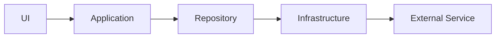

# Domain-Driven Frontend Architecture

This is my preferred structure for medium-to-large frontend applications, particularly Next.js projects.

The main idea is to separate **business logic**, **external dependencies**, and **user interface code**, while grouping business logic by domain.

---

## Project Structure

```text
├── app/
├── domains/
│   ├── product/
│   └── cart/
│       ├── application/
│       ├── dto/
│       ├── fragments/
│       ├── infrastructure/
│       ├── repository/
│       └── schema/
├── infrastructure/
│   ├── cms/
│   └── database/
└── ui/
    ├── assets/
    ├── components/
    ├── features/
    ├── hooks/
    ├── styles/
    └── utils/
```

---

## Core Idea

The architecture has three main areas:

* `domains` — business logic grouped by domain.
* `infrastructure` — integrations with external systems.
* `ui` — presentation and interface code.

A simplified overview:



---

## `app`

The Next.js App Router.

It contains routes, layouts, pages, loading states, error boundaries, route handlers, and other Next.js-specific entry points.

The `app` directory should mainly be responsible for composing the application rather than containing complex business logic.

---

## `domains`

Contains business logic grouped by domain.

Examples of domains:

* `product`
* `cart`
* `checkout`
* `customer`
* `search`

Each domain owns the logic related to that particular area of the application.

For example:

```text
domains/
└── cart/
    ├── application/
    ├── dto/
    ├── fragments/
    ├── infrastructure/
    ├── repository/
    └── schema/
```

Not every domain needs every folder. The structure should grow according to the complexity of the domain.

### Dependency Direction

The general dependency direction is:

```text
application
     ↓
repository
     ↓
infrastructure
     ↓
external service
```

Higher-level layers can depend on lower-level layers, but lower-level layers should not depend on application-specific business logic.

---

# Domain Layers

## `infrastructure`

The infrastructure layer handles low-level communication with external dependencies.

Examples:

* REST APIs
* GraphQL APIs
* CMS platforms
* databases
* search engines
* payment providers
* cookies
* file systems

For example:

```text
domains/
└── cart/
    └── infrastructure/
        ├── cart-api-client.ts
        └── cart-cookie.ts
```

Infrastructure should know **how to communicate with an external system**, but should contain minimal business logic.

Infrastructure used exclusively by one domain can live inside that domain.

Infrastructure shared across multiple domains should live in the root:

```text
infrastructure/
├── cms/
├── database/
└── search/
```

---

## `repository`

The repository layer exposes domain-specific operations for retrieving or modifying data.

For example:

```ts
loadCartById()
loadProductBySlug()
updateCart()
removeCartItem()
```

Repositories hide the details of where the data comes from.

The rest of the application should not need to know whether a product came from GraphQL, REST, a database, or another external service.

Conceptually:

```text
Application

     ↓

loadProductBySlug()

     ↓

Repository

     ↓

API / Database / CMS
```

---

## `application`

The application layer contains **use cases and business logic**.

It coordinates repositories, infrastructure, and domain rules to accomplish a specific task.

For example:

```ts
async function loadValidCart() {
  const cartId = await getCartId()

  if (!cartId) {
    return undefined
  }

  const cart = await loadCartById(cartId)

  return cart.isExpired ? undefined : cart
}
```

In this example:

* `getCartId()` retrieves infrastructure-related information.
* `loadCartById()` retrieves the cart through the repository.
* `isExpired` is used to make a business decision.

The application layer coordinates these operations into a meaningful use case.

---

## `schema`

Contains runtime validation schemas and the TypeScript types derived from them.

Zod is a good fit for this pattern.

```ts
import { z } from 'zod'

export const ProductSchema = z.object({
  id: z.string(),
  name: z.string(),
  price: z.number(),
})

export type Product = z.infer<typeof ProductSchema>
```

This gives us both:

* runtime validation
* TypeScript types

from a single source of truth.

---

## `dto`

DTOs (**Data Transfer Objects**) transform external data into the shape expected by the application.

For example, an external API might return:

```ts
{
  product_id: '123',
  product_name: 'Coffee Maker',
  price_in_cents: 12900
}
```

But internally we might want:

```ts
{
  id: '123',
  name: 'Coffee Maker',
  price: 129
}
```

The DTO handles that transformation.

Conceptually:

```text
External API Response
        ↓
       DTO
        ↓
     Schema
        ↓
Repository / Application
```

This prevents external API structures from leaking throughout the application.

---

## `fragments`

Contains reusable GraphQL fragments when GraphQL is used by the project.

For example:

```graphql
fragment ProductFields on Product {
  id
  name
  sku
  price
}
```

Fragments can then be reused across multiple queries.

---

# Infrastructure

The root `infrastructure` directory contains integrations that are shared by multiple domains.

For example:

```text
infrastructure/
├── cms/
│   ├── client.ts
│   └── request.ts
├── database/
│   └── client.ts
└── search/
    └── client.ts
```

A useful rule:

> If an integration belongs exclusively to one domain, keep it inside that domain. If multiple domains depend on it, consider moving it to the root infrastructure layer.

---

# User Interface

The `ui` directory contains the presentation layer.

```text
ui/
├── assets/
├── components/
├── features/
├── hooks/
├── styles/
└── utils/
```

---

## `components`

Contains small, reusable, application-wide UI components.

Examples:

```text
Button/
Text/
Input/
Modal/
Carousel/
Image/
Video/
```

These components should generally be domain-agnostic.

A `Button` doesn't need to know anything about products or carts.

---

## `features`

A feature represents a larger piece of application functionality.

Examples:

```text
features/
├── cart/
├── search/
├── checkout/
└── product-gallery/
```

A feature can contain its own:

```text
features/
└── cart/
    ├── components/
    ├── hooks/
    ├── stores/
    └── utils/
```

If a component, hook, store, or utility is only used by that feature, it should generally stay inside the feature rather than becoming global.

---

## `hooks`

Contains hooks that are generic enough to be reused across multiple features.

Examples:

```text
useMediaQuery.ts
useClickOutside.ts
useIntersectionObserver.ts
usePrevious.ts
```

Feature-specific hooks should remain inside their corresponding feature.

---

## `assets`

Contains static assets used by the interface.

Examples:

* fonts
* icons
* images
* other static resources

---

## `styles`

Contains shared styling infrastructure.

Examples:

* CSS variables
* design tokens
* mixins
* breakpoints
* global styles
* typography definitions

---

## `utils`

Contains small reusable utilities that don't belong to a specific business domain.

Examples:

```ts
formatPrice()
clamp()
createSlug()
isDefined()
```

Domain-specific utilities should generally remain inside their corresponding domain or feature.

---

# Local vs Global Code

A useful principle is to keep code **as close as possible to where it is used**.

Start locally:

```text
Feature
   ↓
Domain
   ↓
Global
```

For example, if a hook is only used by the search feature:

```text
ui/features/search/hooks/useSearchCarousel.ts
```

is preferable to immediately putting it in:

```text
ui/hooks/useSearchCarousel.ts
```

If it later becomes useful elsewhere, it can be promoted to a shared location.

---

# General Principles

### Separate business logic from UI

UI components should primarily be concerned with rendering and interaction.

Business rules should live in domains or application use cases.

### Hide external APIs behind abstractions

Avoid spreading CMS, database, or API-specific response structures throughout the application.

Use infrastructure, repositories, DTOs, and schemas as boundaries.

### Prefer domain ownership

Code related exclusively to products should generally live in the `product` domain.

Code related exclusively to the cart should generally live in the `cart` domain.

### Avoid premature global abstractions

Something being reusable **in theory** doesn't mean it needs to be global.

Promote code to shared locations when there is an actual reuse case.

### Architecture should serve the project

Not every project needs every layer.

A simple application might only need:

```text
app/
ui/
infrastructure/
```

A larger application may benefit from the complete domain structure.

The goal is maintainability and clear ownership — not adding folders for the sake of following a pattern.
